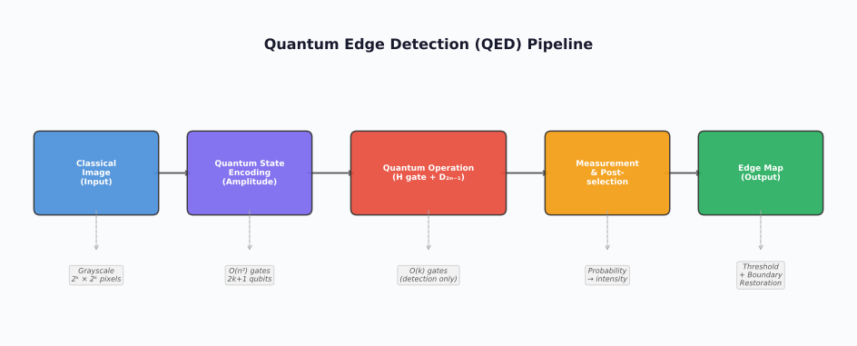

# Quantum Image Edge Detection Based on Laplacian Operator

> **Entry ID**: `fan2019_quantum_laplacian`
> **Last Updated**: 2026-03-13

---

## (A) TL;DR (간단 요약)

- 라플라시안 연산자를 양자 회로로 구현하여 이미지 엣지 검출을 수행하는 알고리즘 제안
- 2차 미분(Laplacian) 기반 엣지 정의로 gradient 기반 방법 대비 등방성(isotropic) 엣지 검출 가능
- FRQI/NEQR 인코딩과 결합하여 양자 라플라시안 필터 회로 설계
- 시뮬레이션에서 클래식 라플라시안 필터와 유사한 결과 달성

---

## (B) 상세 요약

### 문제 정의

1차 미분(gradient) 기반 양자 엣지 검출은 방향에 따른 편향이 있다. 2차 미분(Laplacian)을 양자 회로로 구현하면 등방성 엣지 검출이 가능한가?

### 핵심 아이디어

클래식 라플라시안 커널 $\begin{bmatrix} 0 & 1 & 0 \\ 1 & -4 & 1 \\ 0 & 1 & 0 \end{bmatrix}$에 대응하는 양자 연산을 설계한다. 양자 상태에 인코딩된 이미지에 라플라시안에 해당하는 유니터리 연산을 적용하여 엣지를 검출한다.

### 방법

1. **양자 이미지 인코딩**: FRQI 또는 NEQR로 이미지를 양자 상태에 인코딩
2. **양자 라플라시안 연산**: 위치 큐빗에 대한 제어 연산으로 인접 4방향 픽셀과 중앙 픽셀의 가중 차이를 계산하는 유니터리 구현
3. **보조 큐빗 활용**: 라플라시안 결과를 보조 큐빗에 저장
4. **측정 및 임계값 적용**: 보조 큐빗 측정으로 엣지 강도 추출

### 결과

- 등방성 엣지 검출로 방향 편향 없는 엣지맵 생성
- 시뮬레이션에서 클래식 라플라시안 대비 동등한 검출 품질
- 회로 복잡도는 gradient 기반 방법보다 높음 (4방향 인접 픽셀 연산)

---

## (C) 원리 / 메커니즘

### 양자 회로 / 연산 흐름

```
|Image⟩ ─── [Shift UP] ──┐
|Image⟩ ─── [Shift DOWN] ─┤─── [Sum & Weight] ─── [Compare with center×4] ─── |Edge⟩
|Image⟩ ─── [Shift LEFT] ─┤
|Image⟩ ─── [Shift RIGHT]─┘
```

### 핵심 수식

**이산 라플라시안**:

$$\nabla^2 f(x,y) = f(x+1,y) + f(x-1,y) + f(x,y+1) + f(x,y-1) - 4f(x,y)$$

**양자 구현**: 위치 레지스터에 대한 cyclic shift 연산으로 인접 픽셀 접근:

$$U_{shift} |y,x\rangle = |y, x \oplus 1\rangle$$

---

## (D) 장점 / 기여

- 등방성 엣지 검출: 방향에 무관하게 균일한 엣지 감지
- 라플라시안의 양자 구현에 대한 체계적 프레임워크 제시
- 고차 미분 기반 양자 이미지 처리의 가능성 제시

---

## (E) 문제점 / 한계

| 한계 항목 | 설명 |
|-----------|------|
| 데이터 인코딩 비용 | FRQI/NEQR 인코딩 비용이 여전히 지배적 |
| 노이즈 민감도 | 라플라시안은 노이즈에 매우 민감 (2차 미분 특성); 양자 노이즈 추가 시 더 심각 |
| 확장성 | 4방향 shift 연산으로 gradient 대비 회로 깊이 증가 |
| 재현성 | 시뮬레이션 전용, 실제 하드웨어 검증 없음 |

---

## (F) 비교 / 베이스라인

| 방법 | 엣지 정의 | 등방성 | 노이즈 강건성 | 회로 복잡도 |
|------|----------|--------|-------------|-----------|
| 본 논문 (양자 라플라시안) | 2차 미분 | 예 | 낮음 | 높음 |
| QHED (gradient) | 1차 미분 | 아니오 | 중간 | 낮음 |
| Classical 라플라시안 | 2차 미분 | 예 | 낮음 | O(n²) |
| Classical Canny | 1차 미분 + NMS | 예 | 높음 | O(n²) |

---

## (G) 재현 / 구현 노트

| 항목 | 내용 |
|------|------|
| 필요 라이브러리 | Qiskit, NumPy |
| 데이터셋 | 소규모 그레이스케일 테스트 이미지 |
| 큐빗 수 | 2n + q + ancilla (gradient 대비 보조 큐빗 추가) |
| 회로 깊이 | O(n²) 이상 (4방향 shift + comparison) |
| 실행 환경 | 시뮬레이터 전용 |
| 실행 비용/시간 | 시뮬레이션: gradient 방법 대비 2-4배 |
| 코드 공개 여부 | 미공개 |

---

## (H) 키워드 / 태그

- **데이터 인코딩**: amplitude
- **엣지 정의**: laplacian
- **회로 타입**: shift_operator
- **노이즈 고려**: no
- **평가 방식**: visual, complexity

---

## (I) 인용 정보

```bibtex
@article{fan2019quantum,
  title   = {Quantum image edge detection based on Laplacian operator and zero-cross method},
  author  = {Fan, Ping and Zhou, Ri-Gui and Hu, WenWen and Jing, Naihuan},
  journal = {Quantum Information Processing},
  volume  = {18},
  pages   = {1--23},
  year    = {2019},
  doi     = {10.1007/s11128-019-2270-x},
}
```

**링크**: [https://doi.org/10.1007/s11128-019-2270-x](https://doi.org/10.1007/s11128-019-2270-x)

---

## (J) 그림 / 다이어그램



---

## (K) 오픈 퀘스천 / 후속 연구 아이디어

- 양자 라플라시안에 노이즈 제거(smoothing) 전처리를 결합하면 노이즈 민감도를 줄일 수 있는가?
- LoG(Laplacian of Gaussian)의 양자 구현은 가능한가?
- Gradient + Laplacian 하이브리드 양자 엣지 검출의 가능성은?
