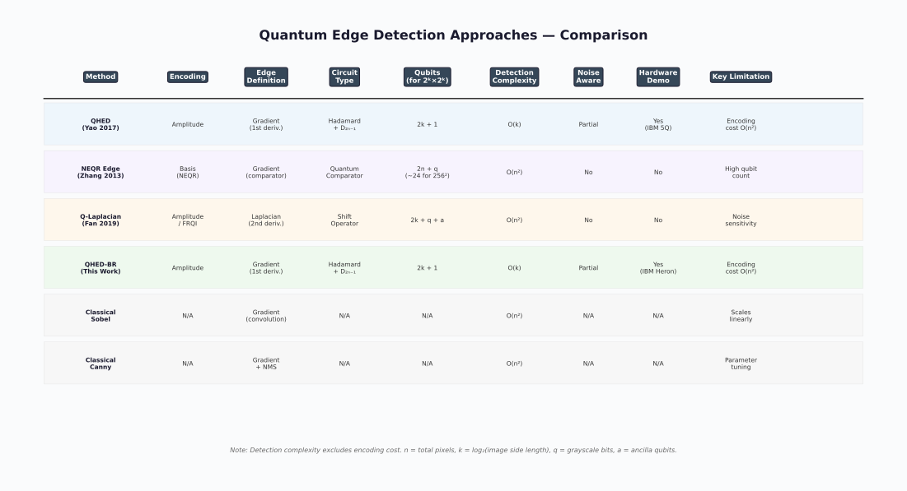

# Quantum Image Processing and Its Application to Edge Detection: Theory and Experiment

> **Entry ID**: `yao2017_qhed`
> **Last Updated**: 2026-03-13

---

## (A) TL;DR (간단 요약)

- Hadamard 게이트와 순환 치환 유니터리(D_{2n-1})를 이용하여 양자 이미지 엣지 검출을 수행하는 QHED 알고리즘 제안
- 인접 픽셀 간 차이를 양자 병렬성으로 계산하여 기존 O(n²) 대비 O(n) 엣지 검출 가능
- IBM 4-qubit 실제 양자 프로세서에서 2×2 이미지 엣지 검출을 실험적으로 검증
- 양자 이미지 처리 분야의 선구적 실험 결과로, 이론과 하드웨어 구현을 모두 제시

---

## (B) 상세 요약

### 문제 정의

클래식 엣지 검출 알고리즘(Sobel, Canny 등)은 이미지 크기 n에 대해 O(n²) 연산이 필요하다. 양자 컴퓨팅의 병렬성을 활용하면 이를 개선할 수 있는가?

### 핵심 아이디어

이미지 픽셀을 양자 상태의 진폭(amplitude)으로 인코딩한 후, Hadamard 게이트와 순환 치환 유니터리 연산을 적용하여 인접 픽셀 간 차이를 병렬로 계산한다. 측정 결과에서 엣지 정보를 추출한다.

### 방법

1. **진폭 인코딩**: 2^k × 2^k 이미지의 픽셀 값을 정규화하여 (2k+1)-큐빗 양자 상태의 진폭으로 인코딩
2. **양자 연산**: 첫 번째 큐빗에 Hadamard 게이트 적용 + 나머지 큐빗에 D_{2n-1} 순환 치환 유니터리 적용
3. **측정**: 첫 번째 큐빗이 |1⟩인 경우를 포스트셀렉션하면 인접 픽셀 차이에 비례하는 확률 분포 획득
4. **엣지맵 구성**: 측정 확률에서 엣지 강도(intensity) 재구성

### 결과

- 이론적으로 O(n) 복잡도의 엣지 검출 달성 (인코딩 제외, 검출 연산만)
- IBM ibmqx2 (5-qubit) 프로세서에서 2×2 이미지 실험 성공
- 시뮬레이션 결과와 실제 하드웨어 결과 간 정성적 일치 확인

---

## (C) 원리 / 메커니즘

### 양자 회로 / 연산 흐름

```
|0⟩ ─── [Amplitude Encoding] ─── H ─── [Measure] ─── Post-select |1⟩
|0⟩ ─── [Amplitude Encoding] ─── D_{2n-1} ── [Measure]
 ...           ...                    ...         ...
|0⟩ ─── [Amplitude Encoding] ─── D_{2n-1} ── [Measure]
```

### 핵심 수식

**진폭 인코딩**:

$$|I\rangle = \frac{1}{\sum_j c_j^2} \sum_{j=0}^{2^{2k}-1} c_j |0\rangle|j\rangle$$

여기서 $c_j$는 j번째 픽셀의 정규화된 강도값.

**Hadamard + D_{2n-1} 연산 후**:

$$|\psi\rangle = \frac{1}{2}\sum_j (c_j + c_{j \oplus (2^{2k}-1)})|0\rangle|j\rangle + \frac{1}{2}\sum_j (c_j - c_{j \oplus (2^{2k}-1)})|1\rangle|j\rangle$$

첫 번째 큐빗이 |1⟩인 경우 포스트셀렉션 → 인접 픽셀 차이 $|c_j - c_{j'}|$에 비례하는 확률.

---

## (D) 장점 / 기여

- 양자 엣지 검출의 이론적 프레임워크를 최초로 체계화하고 실험 검증
- 검출 단계에서 O(n) 복잡도 달성 (클래식 O(n²) 대비)
- 진폭 인코딩 기반으로 지수적 압축 가능 (2^k × 2^k 이미지를 2k+1 큐빗에 인코딩)
- IBM 실제 하드웨어 실험으로 실현 가능성 증명

---

## (E) 문제점 / 한계

| 한계 항목 | 설명 |
|-----------|------|
| 데이터 인코딩 비용 | 진폭 인코딩에 O(n²) 게이트 필요 → end-to-end 복잡도에서 양자 이점 상쇄 가능 |
| 노이즈 민감도 | 실제 하드웨어에서 게이트 오류와 디코히어런스로 인한 결과 품질 저하 |
| 확장성 | 2×2 이미지만 실험; 더 큰 이미지에 대한 실험적 검증 부재 |
| 경계 처리 | 패치 기반 처리 시 패치 경계에서 엣지 정보 손실 (Boundary Restoration 미고려) |
| 재현성 | IBM 하드웨어 접근 필요; 큐빗 수 제한으로 실용적 크기 이미지 처리 불가 |

---

## (F) 비교 / 베이스라인

| 방법 | 검출 복잡도 | 인코딩 복잡도 | 장점 | 단점 |
|------|------------|--------------|------|------|
| QHED (본 논문) | O(n) | O(n²) | 검출 단계 지수 가속 | 인코딩 병목, 작은 실험 규모 |
| Classical Sobel | O(n²) | N/A | 성숙한 기술, 노이즈 강건 | 대규모 이미지에서 느림 |
| Classical Canny | O(n²) | N/A | 정교한 엣지 검출 | 파라미터 튜닝 필요 |

---

## (G) 재현 / 구현 노트

| 항목 | 내용 |
|------|------|
| 필요 라이브러리 | Qiskit (≥1.0), NumPy, Matplotlib |
| 데이터셋 | 임의 2×2, 4×4 그레이스케일 이미지 |
| 큐빗 수 | 2k+1 (2×2 이미지: 5큐빗, 4×4 이미지: 9큐빗) |
| 회로 깊이 | O(n²) (진폭 인코딩 지배적) |
| 실행 환경 | IBM ibmqx2 (5-qubit), Qiskit Aer 시뮬레이터 |
| 실행 비용/시간 | 시뮬레이션: 초 단위 / 하드웨어: 큐 대기 포함 분 단위 |
| 코드 공개 여부 | 논문 내 회로 설명 제공, 별도 공개 리포 없음 |

---

## (H) 키워드 / 태그

- **데이터 인코딩**: amplitude
- **엣지 정의**: gradient
- **회로 타입**: hadamard
- **노이즈 고려**: partial
- **평가 방식**: visual, complexity

---

## (I) 인용 정보

```bibtex
@article{yao2017quantum,
  title   = {Quantum Image Processing and Its Application to Edge Detection: Theory and Experiment},
  author  = {Yao, Xi-Wei and Wang, Hengyan and Liao, Zeyang and Chen, Ming-Cheng and Pan, Jian and Li, Jun and Zhang, Kechao and Lin, Xingcheng and Wang, Zhehui and Luo, Zhihuang and others},
  journal = {Physical Review X},
  volume  = {7},
  number  = {3},
  pages   = {031041},
  year    = {2017},
  doi     = {10.1103/PhysRevX.7.031041},
}
```

**링크**: [https://doi.org/10.1103/PhysRevX.7.031041](https://doi.org/10.1103/PhysRevX.7.031041)

---

## (J) 그림 / 다이어그램




---

## (K) 오픈 퀘스천 / 후속 연구 아이디어

- 진폭 인코딩 비용을 줄이는 근사 인코딩 기법 적용 시 엣지 검출 품질은 어떻게 변하는가?
- 패치 기반 처리에서 경계 복원(Boundary Restoration) 적용 시 전체 엣지맵 품질 개선 정도는?
- NISQ 디바이스의 노이즈 하에서 에러 완화(error mitigation) 기법의 효과는?
- 다중 채널(컬러) 이미지로의 확장 가능성은?
